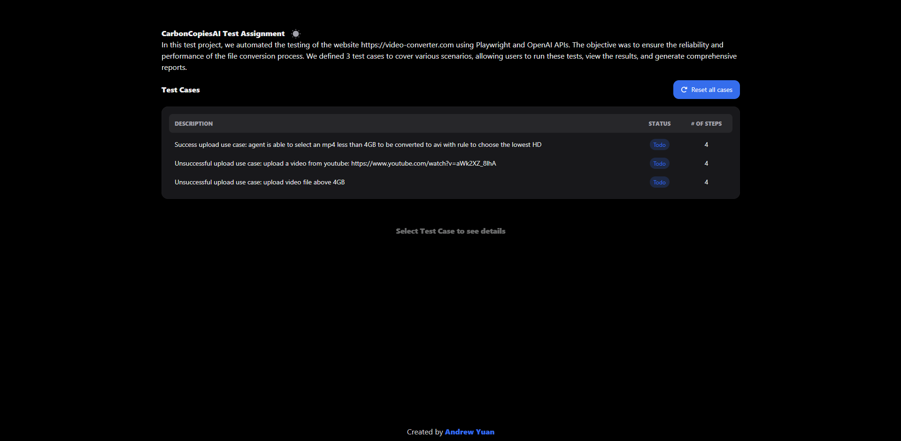
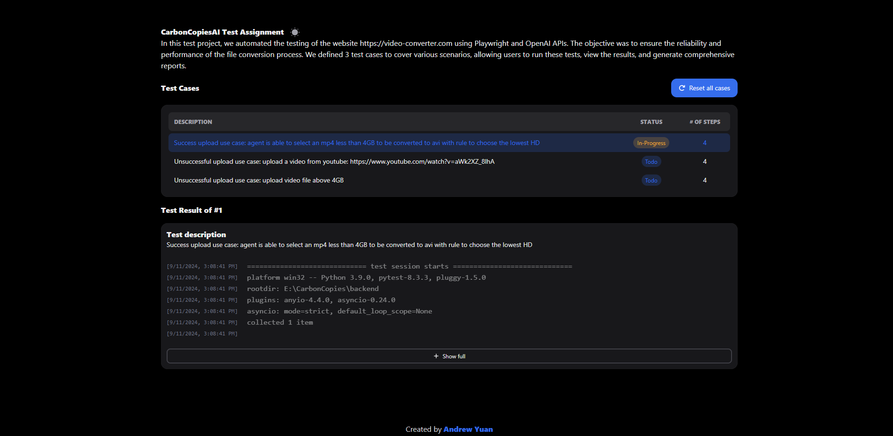
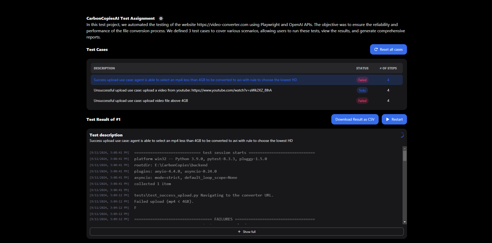

## Project Setup and Launch Guide

### Prerequisites

- Ensure you have Docker and Docker Compose installed on your machine.

### Step-by-Step Setup

1. **Clone the Repository**

   ```sh
   git clone git@github.com:algorithm99129/e2e-testing-service.git
   cd e2e-testing-service
   ```

2. **Configure Environment Variables**

   - **Backend Configuration:**

     - Navigate to the `backend` directory.
     - Copy the example environment file and fill in the required values.
       ```sh
       cp backend/.env.example backend/.env
       ```
     - Open `backend/.env` and set the `OPENAI_API_KEY`:
       ```
       OPENAI_API_KEY=your_openai_api_key
       ```

   - **Frontend Configuration:**
     - Navigate to the `frontend` directory.
     - Copy the example environment file and fill in the required values.
       ```sh
       cp frontend/.env.example frontend/.env
       ```
     - Open `frontend/.env` and set the `VITE_API_URL`:
       ```
       VITE_API_URL=http://localhost:8080
       ```

3. **Build and Launch the Application**

   - Navigate back to the root directory of the project.
   - Use Docker Compose to build and start the services.
     ```sh
     docker-compose up --build
     ```

4. **Access the Application**
   - The backend service will be available at `http://localhost:8080`.
   - The frontend service will be available at `http://localhost:3000`.

### Additional Notes

- Ensure that the `OPENAI_API_KEY` is kept secure and not shared publicly.
- If you need to stop the services, you can use:
  ```sh
  docker-compose down
  ```

That's it! You should now have the application up and running. If you encounter any issues, please refer to the project documentation or seek help from the community.

### Screenshots

Here are some screenshots of the application in action:

#### Image01



#### Image02



#### Image03


